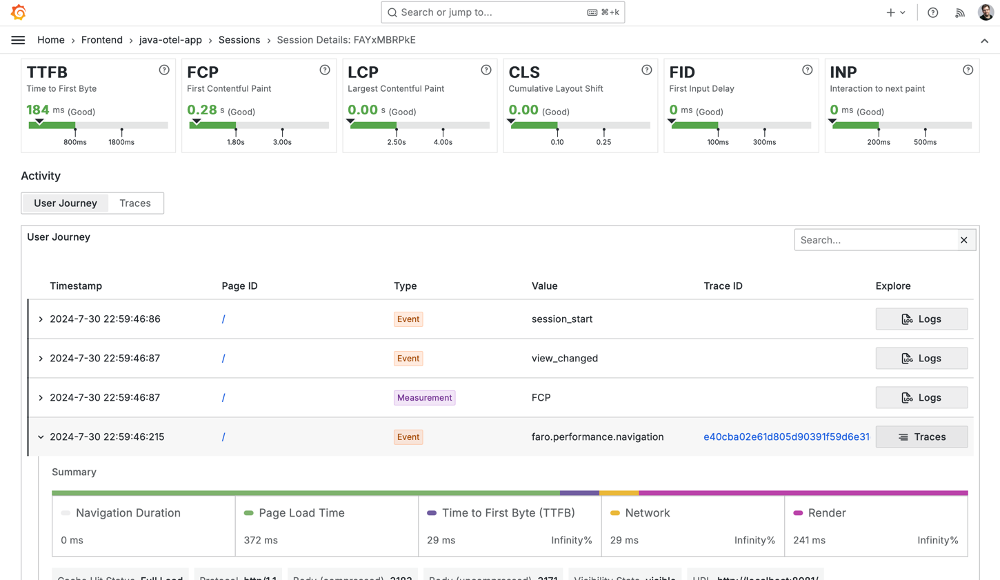

# OTel Java Demo



This repository contains a simple Java application that demonstrates how to use the 
[Grafana OpenTelemetry Distribution for Java].

**Ensure you replace the placeholders in `docker/otelcol/config.yaml` with your own Grafana Cloud API key.**

**Ensure you add your own frontend o11y key in `docker/nginx/default.conf`**

```shell
./gradlew clean bootJar
docker compose build app
docker compose up
```

The application will be available at [http://localhost:8081](http://localhost:8081).
